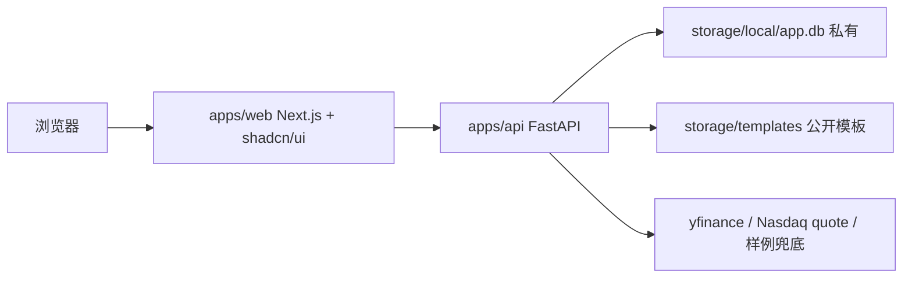

# 总设计

## 目标

新项目用于承接后续股票分析、行情可视化、AI 建议和本地私有数据工作流。当前版本已经完成一个可运行的行情图表工作台，并接入本地交易状态、旧项目信号引擎、回测摘要、AI 日历和 AI Provider 设置。

## shadcn/ui、Ant Design、Streamlit 的区别

`shadcn/ui` 不是传统 npm 组件库。它把组件源码复制进项目，后续可以直接改组件和主题，适合做一套自己的设计系统。它更接近“组件源码模板 + 设计规范”。

`Ant Design` 是完整企业组件库，组件能力丰富、默认风格强、表单和后台系统成熟。缺点是视觉同质化更强，深度定制成本通常高于 shadcn。

`Streamlit` 是 Python 数据应用框架，适合快速做分析原型。它的优势是快，劣势是复杂前端交互、视觉系统、组件拆分、长期工程维护不如 React/Next 项目自由。

本项目选择 shadcn/ui，是为了长期维护、界面一致性和组件可控性。

## 技术架构

## 目录边界

- `apps/web`: 用户界面、图表、交互状态、shadcn 组件。
- `apps/api`: 本地 API、行情适配、SQLite 初始化。
- `storage/templates`: 可公开提交的样例自选股、配置模板、演示数据。
- `storage/local`: 私有运行数据，包含真实自选股、交易记录、AI 输出缓存、数据库。
- `docs/design`: 架构、视觉规范、组件拆分和 review 记录。
- `scripts`: 安全检查、数据迁移、维护脚本。

## 第一版界面

界面定位为交易研究工具，不做营销页。首屏直接进入工作台：

- 左侧主导航：总览、K线工作台、策略研究、AI建议、数据管理、设置。
- 顶部栏：当前环境、数据源状态、刷新按钮。
- 左侧自选股 rail：代码、名称、涨跌幅、最新价。
- 中央图表区：标的标题、五个时间周期、K线蜡烛图、成交量、MA20/60/120/200、十字光标读数条；1日默认显示最近约 4 小时，五日显示完整交易日序列，日内横轴按交易所本地时间显示，日 K/非日内图展示交易流水买卖标记。
- 下方状态区：区间统计和数据源状态，K 线工作台内不再重复放页面级总览。
- 策略研究：策略档案、旧项目加减仓参数、ETF/核心仓/卫星仓分层编辑、后端信号台、回测摘要、资金曲线、单策略交易记录。
- AI 建议：页面只保留“生成每日 AI 建议”、生成失败重试、今日追问、旧项目 AI 日历记录浏览、北京时间交易时段上下文；外部生成会带上账户、持仓、交易流水、MA/RSI/回撤信号、日内走势摘要和新闻标题。AI Provider 统一在数据管理维护。
- 数据管理：总资产、股票池、持仓目标、交易流水录入/编辑、CSV/TSV 导入、AI URL/模型/密钥设置和连接测试，本地 SQLite 优先保存；设置页只保留提交安全说明。

## 图表实现

第一版使用 `tradingview/lightweight-charts`：

- 性能好，适合 K 线和分时图。
- Apache-2.0，适合公开项目。
- API 足够稳定，后续可扩展均线、成交量、十字光标和标记。

借鉴方向：

- 富途 / moomoo：工具型密度、快速切换周期、清晰价格颜色。
- Yahoo Finance：标的信息区、右侧摘要、简洁时间范围切换。
- HQChart：作为后续中国市场高级图表能力参考，不作为第一版依赖。

## 数据隐私设计

公开仓库只放代码和模板。真实数据只存在本地：

- 初次启动时，后端从 `storage/templates/watchlist.example.json` 初始化 SQLite。
- 如果 `storage/local/app.db` 已存在，则读取本地数据库。
- 旧项目私有数据通过 `scripts/import_legacy_private_data.py` 导入 `storage/local/app.db`，包括账户、持仓、交易流水、AI 日历和 AI Provider 设置。
- AI API Key 只保存在本地 SQLite；`GET /api/ai-settings` 只返回 `hasApiKey` 和掩码，不返回原文。
- `.gitignore` 忽略 `storage/local`、`.env*`、数据库文件。
- `scripts/check_public_safety.py` 在提交前扫描常见密钥和私有数据路径。
- 报价优先使用 yfinance；yfinance 限流时尝试 Nasdaq 延迟报价；历史 K 线和策略指标在行情源不可用时只返回 `source=sample`，前端和 AI 不把 sample 当作真实行情依据。

## API 合约

- `GET /health`: 服务状态。
- `GET /api/watchlist`: 自选股。
- `GET /api/quotes`: 报价列表。
- `GET /api/charts/{ticker}?range=&interval=`: K线/分时数据。
- `GET /api/trading-state`: 本地交易状态、派生持仓、账户摘要、校验问题。
- `PUT /api/trading-state`: 保存总资产、股票池、持仓目标、交易流水和策略参数。
- `GET /api/signals`: 使用迁移后的旧 `signal_engine` 返回加减仓信号。
- `GET /api/backtests/{ticker}?range=&initialCash=`: 使用迁移后的旧 `backtest_engine` 返回策略比较。
- `GET /api/ai-advice?date=`: 返回 AI 建议日历、日期列表和选中记录。
- `POST /api/ai-advice/draft`: 生成并保存本地 AI 草案，不调用外部模型。
- `POST /api/ai-advice/generate`: 调用本地配置的 OpenAI-compatible 接口并保存今日 AI 日历记录。
- `POST /api/ai-advice/chat`: 在今日已有 AI 记录后追加一轮追问和回复。
- `GET /api/ai-settings`: 返回 AI Provider URL、模型、密钥掩码和状态。
- `PUT /api/ai-settings`: 保存 AI Provider URL、模型和本地密钥。
- `POST /api/ai-settings/test`: 使用本地或输入中的 AI 配置请求 `/models`，返回连接状态和模型匹配结果。

周期映射：

- `1D`: `range=1d&interval=5m`
- `5D`: `range=5d&interval=15m`
- `日K`: `range=max&interval=1d`
- `周K`: `range=max&interval=1wk`
- `月K`: `range=max&interval=1mo`

## 后续 review 拆分

每个大组件完成后可单独派 review：

- `apps/api/app/modules/market.py`: 行情源、降级数据、时间周期准确性。
- `apps/web/src/features/charts/market-chart.tsx`: lightweight-charts 生命周期和响应式。
- `apps/web/src/features/charts/chart-workspace.tsx`: 页面状态、数据请求和组件组合。
- `apps/api/app/modules/trading_data.py`: SQLite 本地状态、私有数据边界、字段校验。
- `apps/api/app/modules/ai_advice.py`: AI 日历记录、北京时间上下文、每日外部生成、今日追问和后端本地草案兜底。
- `apps/api/app/modules/ai_settings.py`: AI Provider 私有配置和密钥掩码。
- `apps/api/app/modules/signal_engine.py`: 旧项目加减仓信号迁移。
- `apps/api/app/modules/backtest_engine.py`: 旧项目回测指标迁移。
- `scripts/import_legacy_private_data.py`: 旧项目私有数据导入到本地 SQLite。
- `apps/web/src/features/platform/trading-data-context.tsx`: API 优先、本地兜底的状态同步。
- `apps/web/src/features/platform/views/strategy-view.tsx`: 策略参数、后端信号和回测摘要。
- `storage` + `.gitignore` + `scripts/check_public_safety.py`: 隐私边界。
